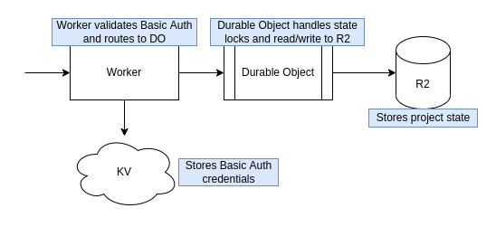

# Serverless Terraform HTTP Backend

This project is a fully serverless [Terraform HTTP Backend](https://www.terraform.io/language/settings/backends/http) created with Cloudflare Workers, KV, Durable Objects, and R2.




### Usage
[](https://deploy.workers.cloudflare.com/?url=https://github.com/broswen/tfstate-edge)

_Note: You must manually create the username and password in the KV Namespace._
```hcl
terraform {
  backend "http" {
    address = "https://my-subdomain.workers.dev/project-name"
    lock_address = "https://my-subdomain.workers.dev/project-name"
    unlock_address = "https://my-subdomain.workers.dev/project-name"
    username = "username"
    password = "password"
  }
}
```


```shell
# Install dependencies
$ yarn install
# Start local development server with live reload
$ yarn dev
# Run tests
$ yarn test
# Run code linting
$ yarn lint
# Update packages
$ yarn update-interactive
```

### TODO
- [ ] fix tests when Miniflare supports R2
- [ ] project scoped permissions
