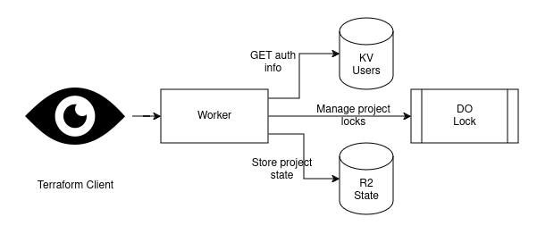

# Serverless Terraform HTTP Backend

This project is a fully serverless [Terraform HTTP Backend](https://www.terraform.io/language/settings/backends/http) created with Cloudflare Workers, KV, Durable Objects, and R2.




### Usage
[](https://deploy.workers.cloudflare.com/?url=https://github.com/broswen/tfstate-edge)

Manually create a user by adding a JSON document in the KVNamespace bound to `KEYS`. The key is the username and the value is a JSON document describing the user information and the names of the projects it has access to.
```json
{
  "username": "username",
  "password": "password",
  "projects": ["project-name"]
}
```

Configure Terraform to use an HTTP backend with the configured username and password. The backend address is the worker hostname with the project name as the path.
```hcl
terraform {
  backend "http" {
    address = "https://my-subdomain.workers.dev/project-name"
    lock_address = "https://my-subdomain.workers.dev/project-name"
    unlock_address = "https://my-subdomain.workers.dev/project-name"
    username = "username"
    password = "password"
  }
}
```

### Development

```shell
# Install dependencies
$ npm install
# Start local development server with live reload
$ npm start
```

### TODO
- [ ] fix tests when Miniflare supports R2
- [x] used capability based security
  - return lock stub only if user authorized for the project
  - move R2 actions inside of lock stub
  - rename Lock class to Project
